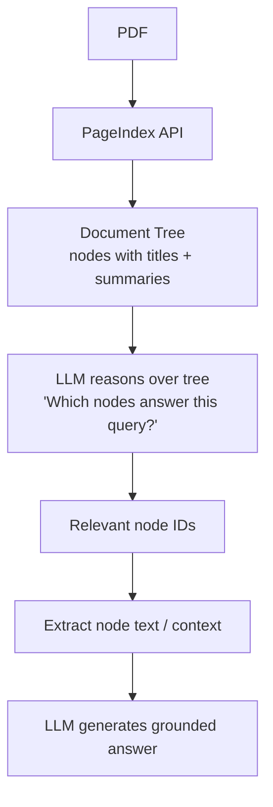

# Vectorless RAG: Reasoning-Based Retrieval over Structured Documents

> **An early implementation of vectorless RAG using reasoning over hierarchical document structure instead of embeddings.**

A lightweight implementation of a next-generation Retrieval-Augmented Generation (RAG) system that eliminates vector embeddings and vector databases, replacing similarity-based retrieval with reasoning over document structure.

---

## Motivation

Traditional RAG pipelines rely on:
- Chunking documents into small pieces  
- Encoding them into embeddings  
- Retrieving based on vector similarity  

However, this approach introduces key limitations:
- ❌ Loss of document structure due to chunking  
- ❌ Semantic similarity ≠ actual relevance  
- ❌ Poor performance on long, structured documents  

This project explores an alternative:

- Retrieval by reasoning over document hierarchy instead of similarity search

---

## Core Idea

Instead of:
Document → Chunks → Embeddings → Vector DB → Similarity Search → Answer

This system follows:
Document → Hierarchical Tree → Reasoning-Based Navigation → Retrieval → Answer

- Documents are represented as a structured tree (like a Table of Contents)
- Each node contains a title and summary
- The LLM reasons over this structure to identify relevant sections

---

## Features

-  No vector database  
-  No embedding model  
-  No chunking  
-  Tree-based document indexing  
-  Reasoning-driven retrieval  
-  Explainable retrieval (traceable decision path)  
-  Optimized for long structured documents  

---

## Comparison

| Feature | Traditional RAG | Vectorless RAG |
|--------|----------------|----------------|
| Retrieval method | Vector similarity | Reasoning over structure |
| Embeddings required | Yes | No |
| Vector DB required | Yes | No |
| Structure preserved | No | Yes |
| Explainability | Low | High |

---

## Pipeline


---

## Project Structure
```plaintext
├── pageindex_tree.py # Step 1: Index PDF → build tree
├── reasoning_based_retrieval.py # Step 2: Select relevant nodes
├── answer_generation.py # Step 3: Generate answer
├── setup_llm.py # Async LLM wrapper
└── data/ # Input PDFs
```

---

## Setup

```bash
git clone https://github.com/yourusername/vectorless-rag.git
cd vectorless-rag

python -m venv .venv
source .venv/bin/activate      # Windows: .venv\Scripts\activate

pip install -r requirements.txt
```
Create a .env file:
PAGEINDEX_API_KEY=your_pageindex_api_key
OPENAI_API_KEY=your_openai_api_key

# Usage
Step 1 — Index Document
```
python pageindex_tree.py
```
Uploads PDF
Builds document tree
Stores doc_id for reuse
Step 2 — Ask Questions
```
python answer_generation.py
```

Output includes:

Retrieved node titles
Reasoning trace
Extracted context
Final answer
# Example Output
Retrieved Nodes:
Node 3 → Attention Overview
Node 7 → Scaled Dot-Product Attention
Node 12 → Multi-Head Attention

Reasoning:
The query relates to attention mechanisms. Node 3 provides overview,
Node 7 explains computation, Node 12 extends to multi-head usage.

Generated Answer:
The attention mechanism computes a weighted sum of values...

# How It Works
Tree-Based Indexing

The document is converted into a hierarchical structure:

- Sections → Subsections → Nodes

This preserves context and relationships.

# Reasoning-Based Retrieval

The LLM:

- analyzes node summaries
- selects relevant nodes
- navigates the document tree

# Explainability

Each answer includes:
- reasoning trace
- source sections
This makes retrieval transparent and auditable.

# Why This Matters
Vectorless RAG shifts the paradigm from:
- "Find similar text" → "Find where the answer lives"
This approach:
- Preserves document structure
- Enables multi-hop reasoning
- Improves explainability
- Aligns with how humans read documents

# Future Work
- Multi-document reasoning
- Hybrid RAG (vector + reasoning)
- Vision-based document understanding
- Agentic tree traversal
# References
- https://pageindex.ai/blog/pageindex-intro
- https://techcommunity.microsoft.com/blog/azuredevcommunityblog/vectorless-reasoning-based-rag-a-new-approach-to-retrieval-augmented-generation/4502238
